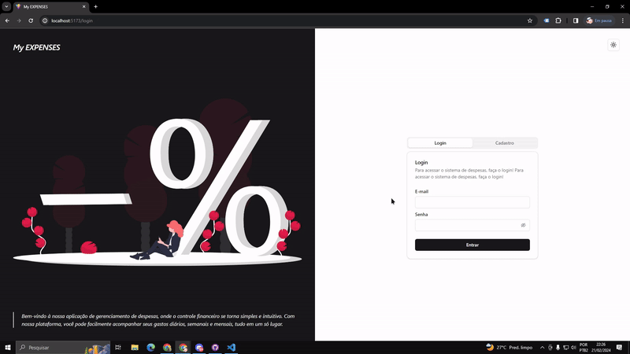

# My EXPENSES
Bem-vindo ao My EXPENSES!

O My EXPENSES é uma plataforma projetada para oferecer um controle financeiro simples e prático. O  objetivo é fornecer uma maneira eficiente para os usuários registrarem suas receitas e despesas, permitindo uma visualização financeira mais consciente e eficaz.

Com o My EXPENSES, os usuários podem facilmente cadastrar suas entradas e saídas de dinheiro, fornecendo uma visão clara e organizada de suas finanças.

# 🖥️ INTERFACES
## Desktop

### Tela de cadastro e login
<p align-items="center">
  
</p>

### Tela de Dashboard e de Lista de transações
https://github.com/maycon-mdrs/my-expenses/assets/81583731/db230818-9a11-46dd-9893-557f800e5789

### Tela de configurações
<p align-items="center">
  working...
  
</p>

## Mobile
### Tela de cadastro e login
<p align-items="center" style="height: 400px">
    
</p>

### Tela de Dashboard e de Lista de transações
https://github.com/maycon-mdrs/my-expenses/assets/81583731/18fb1fc6-80ec-4819-96e1-4f0ac236d275

### Tela de configurações
<p align-items="center">
  working...
  
</p>

# Acesso ao Login & Cadastro
Atualmente, o projeto apresenta uma tela dedicada ao processo de login e cadastro, proporcionando aos usuários uma porta de entrada para explorar suas funcionalidades. No entanto, é importante ressaltar que essa tela não está conectada a nenhuma API externa neste momento.

# Armazenamento das Transações
Os usuários pode facilmente registrar suas transações de forma simples e direta, seja uma entrada ou saída de dinheiro. Essas transações são armazenadas utilizando a Context API e o Local Storage:
```json
[
  {
    "id": 1708480291968,
    "title": "Ganhei mesada",
    "description": "dinheiro dos pais",
    "date": "2024-02-21T01:51:31.968Z",
    "inflow": 700,
    "outflow": 0
  },
  {
    "id": 1708480241374,
    "title": "Pagar conta",
    "description": "conta nubank",
    "date": "2024-02-16T03:00:00.000Z",
    "inflow": 0,
    "outflow": 400
  }
]
```
```js
export interface DataType {
    id: number;
    title: string;
    description: string;
    date: Date;
    inflow: number;
    outflow: number;
}

export interface DataList {
    data: DataType[];
    setData: (data: DataType[]) => Promise<void>;
    addData: (data: DataType) => Promise<void>;
    removeData: (id: number) => Promise<void>;
}
```

# 🎲 Rodando o código

### FrontEnd
```bash
# Clone este repositório
$ git clone <https://github.com/maycon-mdrs/my-expenses>

# Acesse a pasta do projeto
$ cd my-expenses

# Instale as dependências
$ npm install

# Execute a aplicação em modo de desenvolvimento
$ npm run dev

# Acesse <http://localhost:5173/>
```

# SOBRE O PROJETO
### 🛠 Tecnologias

- `Context API e Local Storage:` armazenamento dos dados do usuário (Login), armazenamente das transações do usuário, tema light e dark.

- `Recharts:` Utilização da biblioteca Recharts para criar visualizações de dados dinâmicas e interativas. Com Recharts, foi feito um dashboard para apresentar as transações de entrada e sáida do usuário em cada mês.

- `React Router Dom:` Utilização do React Router Dom para gerenciar as rotas da aplicação. Além disso, foi feito o uso do **useSearchParams** para acessar e manipular os parâmetros de busca na URL para utilizar o filtro.

- `usehooks-ts:` Foi incorporado o pacote usehooks-ts para aproveitar uma variedade de hooks customizados em nosso projeto. Esses hooks fornecem funcionalidades adicionais e simplificam o desenvolvimento, garantindo um código limpo e modular. 


As seguintes ferramentas foram usadas na construção do projeto:

- [React](https://pt-br.reactjs.org/)
- [Vite](https://vitejs.dev/)
- [TypeScript](https://www.typescriptlang.org/)
- [AntDesign](https://ant.design/)
- [Tailwind](https://tailwindcss.com/)
- [Shadcn/ui](https://ui.shadcn.com/)

# Autor

<a href="https://github.com/maycon-mdrs" style= "float: left">
    <div style="display: flex; flex-direction: column; align-items: center">
        
        <br />
        <strong>Maycon Douglas Rêgo Santos 🚀</strong>
    </div>
</a>
